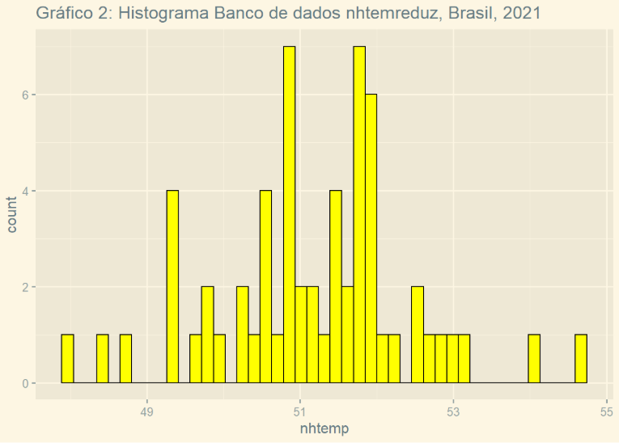

# ETP_usando_R
---
title: "Análise Estatística e Séries Temporais com R"
author: "Wenner Cruz Severino"
date: "`r Sys.Date()`"
output:
  github_document:
    toc: true
    toc_depth: 3
---

# Análise Estatística utilizando R

## Introdução

Este projeto apresenta uma análise exploratória do conjunto de dados **nhtemp**, disponível na linguagem R. O conjunto contém as temperaturas médias anuais registradas na cidade de New Haven, Connecticut (Estados Unidos), entre os anos de 1912 e 1971.

Durante o desenvolvimento foram utilizadas técnicas de manipulação de dados, estatística descritiva, visualização gráfica e análise de séries temporais, empregando bibliotecas amplamente utilizadas na linguagem R.

---

# Objetivos

O projeto possui os seguintes objetivos:

- Explorar o conjunto de dados `nhtemp`;
- Converter uma série temporal para um formato adequado para análise estatística;
- Calcular medidas estatísticas descritivas;
- Construir histogramas para visualizar a distribuição dos dados;
- Criar um subconjunto dos dados utilizando filtros;
- Comparar estatísticas entre os conjuntos original e reduzido;
- Representar os dados utilizando gráficos de séries temporais.

---

# Tecnologias Utilizadas

- R
- R Markdown
- ggplot2
- dplyr
- ggthemes
- forecast
- fpp2

---

# Estrutura do Projeto

```
Analise-Estatistica/
│
├── Analise.Rmd
├── Analise.html
├── README.Rmd
├── README.md
├── imagens/
│   ├── histograma_original.png
│   ├── histograma_reduzido.png
│   ├── serie_temporal.png
│   └── estrutura_dados.png
└── dados/
```

---

# Base de Dados

O conjunto **nhtemp** é disponibilizado nativamente pelo R e contém as temperaturas médias anuais registradas em New Haven.

Características da base:

| Característica | Valor |
|----------------|-------|
| Tipo | Série Temporal |
| Início | 1912 |
| Fim | 1971 |
| Frequência | Anual |

Cada observação representa a temperatura média registrada em determinado ano.

---

# Preparação dos Dados

Inicialmente, a série temporal foi convertida para um `data.frame`, facilitando a manipulação dos dados utilizando funções do pacote **dplyr**.

Também foi criada uma coluna contendo os anos correspondentes a cada observação.

```r
nhtempdf <- data.frame(nhtemp)

nhtempdf <- mutate(
    nhtempdf,
    anos = seq(1912, 1971, 1)
)
```

---

# Estrutura dos Dados

O objeto original `nhtemp` possui estrutura do tipo **ts (time series)**.

Embora esse formato seja adequado para operações envolvendo séries temporais, muitas funções de manipulação de dados e visualização trabalham de forma mais eficiente com objetos do tipo **data.frame**.

Após a conversão, cada linha representa uma observação e cada coluna representa uma variável.

Essa organização facilita filtros, cálculos estatísticos e geração de gráficos.

---

# Estatística Descritiva

Foram calculadas diversas medidas estatísticas para compreender o comportamento das temperaturas.

Entre elas:

- Média
- Mediana
- Valor mínimo
- Valor máximo
- Desvio padrão

Essas medidas permitem resumir as principais características da distribuição dos dados.

---

# Histograma

Foi elaborado um histograma para visualizar a distribuição das temperaturas registradas.

O gráfico possibilita identificar:

- concentração dos valores;
- dispersão;
- possíveis assimetrias;
- frequência das observações.


*Figura 1 – Histograma da base original.*

---

# Filtragem dos Dados

Foi criado um novo conjunto de dados contendo apenas observações dentro de um intervalo específico de temperaturas.

Essa etapa permite comparar o comportamento estatístico entre a base completa e uma base reduzida.

As operações de filtragem foram realizadas utilizando funções do pacote **dplyr**.

---

# Nova Estatística Descritiva

Após a filtragem, as principais medidas estatísticas foram recalculadas.

Essa comparação possibilita observar como a remoção de determinados valores influencia:

- média;
- mediana;
- amplitude;
- desvio padrão.

---

# Histograma da Base Reduzida

Também foi construído um histograma para o conjunto reduzido.

Neste gráfico foi utilizado um número maior de divisões (*bins*), permitindo visualizar a distribuição dos dados com maior nível de detalhe.



*Figura 2 – Histograma após filtragem.*

---

# Análise de Séries Temporais

A última etapa consistiu na construção de gráficos de séries temporais.

Primeiramente os dados foram convertidos novamente para o formato `ts`.

```r
ts_grafico_nhtemp <- ts(
    data = nhtempdf$nhtemp,
    start = c(1912,1),
    frequency = 1
)
```

Posteriormente foi utilizada a função `autoplot()` para representar a evolução das temperaturas ao longo dos anos.

Essa visualização permite identificar tendências, variações e possíveis mudanças no comportamento das temperaturas durante o período analisado.


*Figura 3 – Evolução das temperaturas ao longo do tempo.*

---

# Resultados

Durante a análise foi possível:

- organizar uma série temporal em formato tabular;
- calcular medidas estatísticas descritivas;
- comparar conjuntos de dados antes e após filtragem;
- visualizar a distribuição das temperaturas por meio de histogramas;
- representar a evolução temporal dos dados utilizando gráficos específicos para séries temporais.

---

# Como Executar

1. Instale o R.

2. Instale o RStudio.

3. Instale as bibliotecas necessárias.

```r
install.packages("ggplot2")
install.packages("dplyr")
install.packages("ggthemes")
install.packages("forecast")
install.packages("fpp2")
```

4. Abra o arquivo `.Rmd`.

5. Execute todos os blocos de código.

---

# Aprendizados

Este projeto permitiu reforçar conhecimentos relacionados à manipulação de dados em R, estatística descritiva e análise de séries temporais. Além disso, proporcionou experiência no uso de bibliotecas voltadas para visualização gráfica e organização de dados, demonstrando como diferentes técnicas podem ser combinadas para compreender o comportamento de uma base de dados ao longo do tempo.

---

# Autor

**Wenner Cruz Severino**
